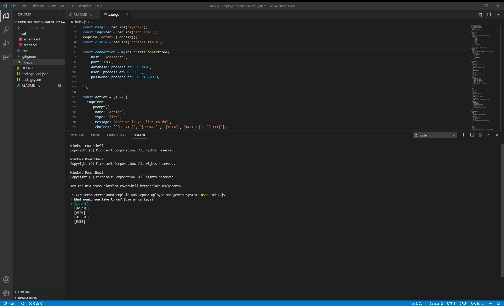

  

# **Employee-Management-System**

## Link to GitHub repo:
[Employee Management System](https://github.com/charvey0/Employee-Management-System)

## Image of terminal:

## Walkthrough video of live deployment:

# Table of Contents
* [Project Description](#project-description)
* [Installation](#installation)
* [Usage](#usage)
* [Tests](#tests)
* [License](#license)
* [Contributions](#contributions)
* [Questions](#questions)
# Project Description

This app allows the user to structure and manage employee information.  All information can be CREATED, UPDATED, READ and DELETED from the database from the command line.  Once an entry is created in one of the tables, any piece of data can be editted.

### Technologies used:
- javaScript
- Node.js
- Inquirer
- MySql
- GitHub
- GitBash
- Dotenv
- console.table
    
# Installation
 
 1. Clone this repo  
 2. Type **npm i** in the command line.
 3. Open **index.js** in the console.   
 

# Usage

This app allows the user to structure and manage employee information.  All information can be CREATED, UPDATED, READ and DELETED from the database from the command line.  Once an entry is created in one of the tables, any piece of data can be editted.

# Tests

I don't have any tests yet.  I am working on it.

# License

MIT

# Contributions

Thank you for your interest in contributing.  You can fork this project and adapt it to fit your needs.

# Questions

If you have any questions, please contact the project owner by clicking on the email listed below.  
     
#### [charvey0](https://github.com/charvey0)
#### [charvey0@gmail.com](mailto:charvey0@gmail.com)
